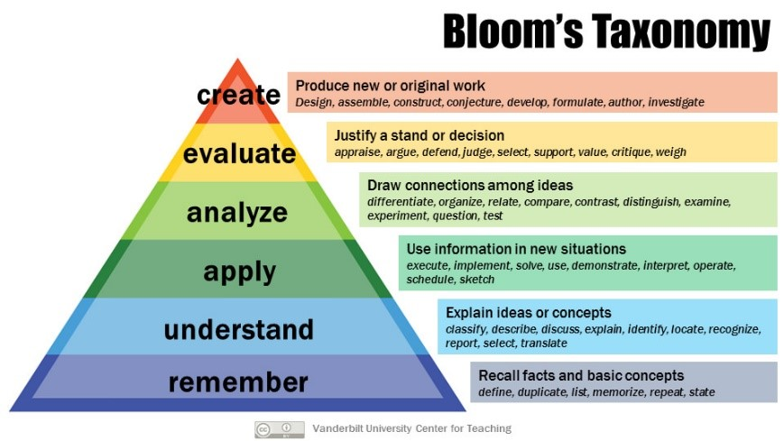

```{r setup, include=FALSE}
knitr::opts_chunk$set(echo = TRUE)
```

## Identificación del curso

Código: **14100.17**

Nombre: **Reproducible Research Practices (o *¿Qué puedo hacer para que mi próximo artículo sea (más) reproducible?*)**

Plan de Formación Transversal en Investigación: PDF/Doctorado Curso Académico: 2020/2021

Horas de formación: **20 horas en total que incluye asistencia más trabajo autónomo.** Fechas y horario de impartición: **14, 16, 21, 23, 28 y 30 de abril de 2021, de 10 a 11**

Idioma de impartición: **castellano** (Nota: en años pares se imparte en inglés, en años impares en castellano)

Plazas ofertadas: **40 en modalidad online síncrona** Tasa: **gratuito**

**Profesorado**:

-   **Dr. Carlos Granell Canut** (Dep. de Lenguajes y Sistemas Informáticos. Universitat Jaume I)
-   **Dr. Sergi Trilles Oliver** (Dep. de Lenguajes y Sistemas Informáticos. Universitat Jaume I)

Ficha en la Escuela de Doctorado: [web Formación Transversal](https://www.uji.es/estudis/centres/escola-doctorat/base/Formacio-transversal/)

## Requisitos

-   Ser doctorando o doctoranda en un programa de doctorado de la Universitat Jaume I, o
-   Ser PDI en activo en la UJI.

Como el curso se centra en prácticas reproducibles en tareas de investigación que utilizan en mayor o menor medida métodos computacionales, los perfiles idóneos de los participantes son los de áreas científico-técnicas. Sin embargo, el curso está abierto a otras áreas de conocimiento, como se apunta en la sección de motivación. Los/as participantes habrán cursado preferentemente el curso de "Recursos Bibliográficos para la Investigación y Conocimiento Abierto".

## Motivación

Cada vez es más habitual encontrar artículos publicados en revistas académicas que utilizan métodos computaciones en la sección de métodos y/o para la generación de los resultados. No es necesario que el artículo tenga como finalidad el diseño y desarrollo de una herramienta informática. En otros campos, ya sean de las ciencias sociales, economía, o salud, muchos trabajos científicos utilizan herramientas y métodos computacionales para recoger y procesar datos de encuestas en forma de tabla o gráficos, o para analizar datos socio-económicos de un área de estudio en forma de mapas.

Las herramientas y métodos computacionales son parte fundamental del desarrollo de proyectos científicos en cualquier disciplina. Seguro que más de uno/a ha sufrido la frustración y horas de arduo trabajo para recuperar (es decir, volver a ejecutar, reutilizar o recrear) un código (un análisis computacional que generaba una figura o tabla, por ejemplo) que desarrolló/utilizó unos meses atrás. Lamentablemente, se presta escasa o nula atención a la formación, especialmente en el periodo de formación doctoral en prácticas reproducibles aplicadas a tareas/proyectos de investigación.

Pero la reproducibilidad es clave en un proyecto de tesis doctoral. Adquirir hábitos y buenas prácticas en el día y día es clave para que los resultados obtenidos (ya sean mapas, tablas, gráficos, estadísticas u otro tipo de recursos que dependen de métodos y análisis computacionales) sean fiables, comprensibles, transparentes y, sobretodo, reproducibles a lo largo del período doctoral (y más allá). Pensar en la reproducibilidad en el momento de enviar un artículo (o depositar la tesis doctoral) porque la revista nos pide que se adjunten los datos y código utilizados es demasiado tarde. Para que un proyecto de investigación sea reproducible, hay que planificarlo desde el principio e incorporar las practicas reproducible al trabajo diario del proyecto.

Si tu investigación utiliza métodos computacionales para capturar, procesar y/o visualizar datos, sin importar la disciplina, entonces este curso puede ayudarte a conocer y adquirir prácticas en investigación reproducible.

Si tu investigación de doctorado es teórica, se trata de una revisión histórica, o el uso de herramientas informáticas se limita a software de presentaciones (p.e. Powerpoint) y de edición de textos (p.e. Word), este curso puede que no esté entre tus prioridades ahora mismo. Aun así, podría interesarte conocer los conceptos relacionados con la reproducibilidad científica, y adoptar prácticas reproducibilidad en otras actividades académicas como, por ejemplo, en la creación de contenidos docentes o presentaciones.

## Competencias y destrezas personales

Las competencias específicas (CE) del curso versan sobre la capacidad de organizar y planificar en general[^1]. En particular:

[^1]: Ver clasificación de [Tuning](https://www.unideusto.org/tuningeu/competences/generic.html).

-   CE01: (Capacidad de) Diseñar, planificar y organizar recursos asociados con una actividad/proyecto de investigación para que sea más reproducible.
-   CE02: (Capacidad de) Crear documentos computacionales (*notebooks*) combinando código, texto y resultados.

Los resultados de aprendizaje que el/la participante logrará al final del curso son los siguientes, destacando la acción (verbo) en negrita e indicando el nivel de la taxonomía de Bloom al que corresponde el resultado de aprendizaje, y la competencia especifica con la que está relacionado.

```{r echo=FALSE, layout="l-body-outset", fig.cap="Figure from https://cft.vanderbilt.edu/guides-sub-pages/blooms-taxonomy/", out.extra="class=external"}


```

+-------+---------------------------------------------------------------------------------------------------------------------------------------------------------------------------------------------+-------------------+------+
| \#    | Resultados de aprendizaje                                                                                                                                                                   | Bloom             | CE   |
+=======+=============================================================================================================================================================================================+===================+======+
| RRP01 | **Reconocer** la importancia de la investigación reproducible (computacional) como un pilar fundamental de la ciencia moderna, y sus tendencias principales (reproducir, replicar, recrear) | Low - Remember    | CE01 |
+-------+---------------------------------------------------------------------------------------------------------------------------------------------------------------------------------------------+-------------------+------+
| RRP02 | **Comparar y contrastar** las tendencias en investigación reproducible contextualizadas a la disciplina propia de cada estudiante                                                           | High - Analyse    | CE01 |
+-------+---------------------------------------------------------------------------------------------------------------------------------------------------------------------------------------------+-------------------+------+
| RRP03 | **Describir y distinguir** los criterios de reproducibilidad.                                                                                                                               | Low - Understand  | CE01 |
+-------+---------------------------------------------------------------------------------------------------------------------------------------------------------------------------------------------+-------------------+------+
| RRP04 | **Evaluar** el nivel e reproducibilidad en trabajos de investigación propios u otros propuestos.                                                                                            | High - Apply      | CE01 |
+-------+---------------------------------------------------------------------------------------------------------------------------------------------------------------------------------------------+-------------------+------+
| RRP05 | **Organizar** recursos de un proyecto para facilitar la reproducibilidad y reutilización.                                                                                                   | Low -- Understand | CE01 |
+-------+---------------------------------------------------------------------------------------------------------------------------------------------------------------------------------------------+-------------------+------+
| RRP06 | **Contrastar** las familias principales de licencias para software y datos.                                                                                                                 | High -- Analyse   | CE01 |
+-------+---------------------------------------------------------------------------------------------------------------------------------------------------------------------------------------------+-------------------+------+
| RRP07 | **Comprender** las buenas prácticas de citación de datos y software.                                                                                                                        | Low -- Understand | CE01 |
+-------+---------------------------------------------------------------------------------------------------------------------------------------------------------------------------------------------+-------------------+------+
| RRP08 | **Comprender** el valor de combinar una pregunta, código fuente y el resultado.                                                                                                             | Low -- Remember   | CE02 |
+-------+---------------------------------------------------------------------------------------------------------------------------------------------------------------------------------------------+-------------------+------+
| RRP09 | **Aplicar** *notebooks* para la documentación de análisis computacionales.                                                                                                                  | High -- Apply     | CE02 |
+-------+---------------------------------------------------------------------------------------------------------------------------------------------------------------------------------------------+-------------------+------+
| RRP10 | **Diseñar y crear** *notebooks* para la creación de artículos científicos, informes técnicos o presentaciones.                                                                              | High -- Create    | CE02 |
+-------+---------------------------------------------------------------------------------------------------------------------------------------------------------------------------------------------+-------------------+------+

: Lista de resultados de aprendizaje.

<aside>

No se habla de "aprender a programar" como resultado de aprendizaje o de "saber programar" como requisito previo. Por supuesto, se presupone cierta disponibilidad y mentalidad abierta para que los participantes del curso puedan incorporar nuevas prácticas/recomendaciones en su proceso de investigación, incluso cuando se trata de un proceso consolidado de años.

</aside>

## Contenidos

**Semana 1: Introducción a la reproducibilidad.** En esta semana se tratan los resultados de aprendizaje RRP01-04

-   Sesión 1.1: [Reproducibilidad y replicabilidad](sesion11.html)

-   Sesión 1.2: [Evaluación de la reproducibilidad](sesion12.html)

**Semana 2: Prácticas y recomendaciones.** En esta semana se tratan los resultados de aprendizaje RRP05-07

-   Sesión 2.1: [Organización, recomendaciones y buenas prácticas reproducibles](sesion21.html)

**Semana 3: Literate programming y notebooks.** En esta semana se tratan los resultados de aprendizaje RRP08-10

-   Sesión 3.1: Literate programming y markdown

-   Sesión 3.2: Notebooks

## Metodología docente

La metodología docente del curso se alinea con una clase al revés donde se plantean actividades antes, durante y después de una clase presencial. Sin embargo, el modelo online impuesto para esta edición del curso, implica obviamente modificaciones para las actividades inicialmente diseñadas para la case presencial. Estas actividades se reemplazan por trabajo asíncrono y sesiones online síncronas. Se establecen, sujetas a las necesidades que vayan surgiendo durante el curso, una sesión online síncrona (1 hora) por semana a modo de tutoría y resolución de dudas de las actividades planteadas.

## Evaluación

Para superar el curso se requiere de la entrega de las actividades imprescindibles del curso, tal como se indica en cada sesión.

## Materiales

Los materiales del curso estarán accesibles en el "Aula Virtual" de la Universitat Jaume I, para el seguimiento por parte de los participantes, y como herramienta de comunicación. disponible en el aula virtual.
