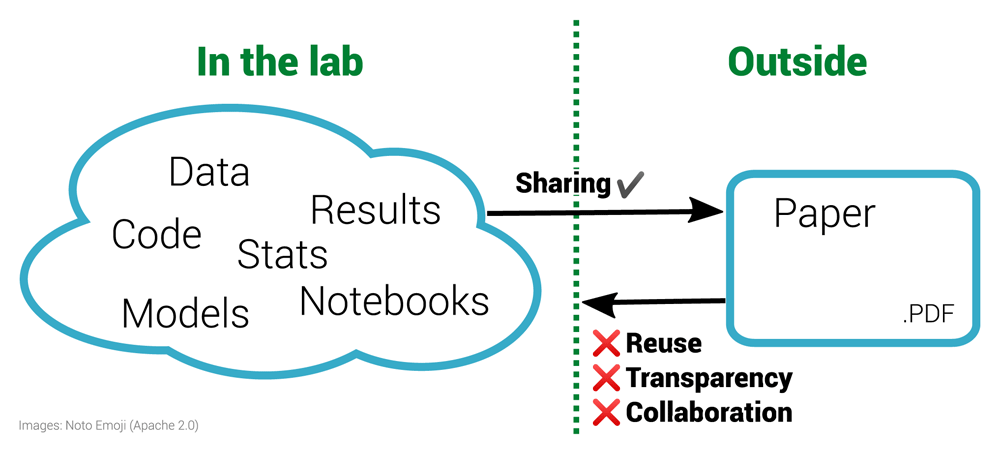

```{r setup, include=FALSE}
options(htmltools.dir.version = FALSE)
knitr::opts_chunk$set(collapse = TRUE,
                      fig.retina = 3)
```

```{r share-again, echo=FALSE}
library(xaringanExtra)

xaringanExtra::use_share_again()
xaringanExtra::style_share_again(
  share_buttons = c("twitter", "linkedin", "pocket")
)
```


```{r, load_refs, include=FALSE, cache=FALSE}
source("load_references.r")
```

name: title
class: Left, middle
background-image: url(images/rawpixel/nasa-jupiter.jpg)
background-size: cover


# .whiteinline[.fancy[`r rmarkdown::metadata$title`]]

### .whiteinline[`r rmarkdown::metadata$subtitle`]

.whiteinline[`r rmarkdown::metadata$description` &#183; `r rmarkdown::metadata$date`]

.right[.whiteinline[`r rmarkdown::metadata$author` &#183; Sergi Trilles]]

.right[.whiteinline[`r rmarkdown::metadata$institute`]]

???

This enhanced color view of Jupiter's south pole was created using data from the JunoCam instrument on NASA's Juno spacecraft. Original from NASA.
Source: [Rawpixel](https://www.rawpixel.com/image/440596/jupiters-south-pole)

---
name: spacecraft
class: bottom, middle
background-image: url(images/rawpixel/nasa-cygnus-spacecraft.jpg)
background-size: cover


---
template: spacecraft

## Focus is the art of knowing what to ignore.

### The fastest way to raise your level of performance: Cut your number of commitments in half.

---
class: inverse, center, middle

# Reproducibility in Science

---
class: center
# Reproducibility in Science

## Doubt is inherently human and we (scientists) always have doubts!

--

### (Well, that doesn’t mean it’s OK to keep questioning climate change, evolution, and the power of vaccines...)

---
class: center
# Reproducibility in Science


## Advancing science and knowledge requires

--

### openness

--

### transparency

--

### reproduction

--

### cumulative evidence (replication)


---
class: center, middle

# Is reproducibility a new problem?

--

### Let's go back to the 17th century...


---
class: center
# Boyle vs Huygens

.pull-left[


[Robert Boyle](https://en.wikipedia.org/wiki/Robert_Boyle)
]

.pull-right[


[Christiaan Huygens](https://en.wikipedia.org/wiki/Christiaan_Huygens)

]


---
class: center, middle

# Boyle's [air-pump](https://en.wikipedia.org/wiki/Air_pump) was one of the first documented disputes over reproducibility...


---
class: center
# Boyle vs Huygens

.pull-left[

### Huygens reported a new effect he termed "anomalous suspension" in Amsterdam.

### Boyle could not replicate this effect in his own air pump in UK.

### Huygens was invited to UK (1663) to personally help Boyle __replicate__ anomalous suspension of water.

]


.pull-right[


]


???

[Source](https://en.wikipedia.org/wiki/Reproducibility)


---
class: center
# Newton vs Flamsteed

.pull-left[


[Isaac Newton](https://en.wikipedia.org/wiki/Isaac_Newton)
]

.pull-right[


[John Flamsteed](https://en.wikipedia.org/wiki/John_Flamsteed)

]


---
class: center, middle

# Flamsteed's lunar data & Newston's request for raw data 

--

In 1695, Sir Isaac Newton wrote a letter to the British Astronomer Royal John Flamsteed, whose data on lunar positions he was trying to get for more than half a year. Newton declared that

--

> “these and all your communications will be useless to me unless you can propose some practicable way or other of supplying me with observations … __I want not your calculations, but your observations only__.” `r Cite(my_refs, "noy2019")`

???

[Kollerstrom, N. & Yallop, B. D. J. Hist. Astron. 26, 237–246 (1995)](https://doi.org/10.1177%2F002182869502600303).


---
class: center, middle

# Is reproducibility a new problem?

--

### Let's go back to 40 years ago, with the birth of personal computers...

---
class: center

# Literate programming 

.pull-left[

### [Literate programming](https://en.wikipedia.org/wiki/Literate_programming): a new methodology of programming. `r Cite(my_refs, "knuth1984")`

### "Programs are meant to be read by humans, and only incidentally for computers to execute."

### A programme combines human language and code.


]

.pull-right[


[Donald E Knuth](https://en.wikipedia.org/wiki/Donald_Knuth)


]

---
class: center, middle

# Is reproducibility a new problem?

--

### Let's go back to 30 years ago, with the birth of Internet...

---
class: center

# Electronic documents


.pull-left[

## `r my_refs["claerbout1992"]$title` `r Cite(my_refs, "claerbout1992")`

### Executable digital notebook

### Be open & help others

### Document for future self
]

.pull-right[

]

---
class: center, middle

# Is reproducibility a new problem?

--

### No, it is not _NEW_, but it _IS_ still a problem. 


---
class: left, bottom
background-image: url(images/supertramp.jpg)
background-size: contain


---
class: center

# 1,500 scientists lift the lid on reproducibility `r Cite(my_refs, "baker2016")`


.pull-left[

### +70% of researchers have tried and failed to reproduce another scientist's experiments

### +50% have failed to reproduce their own experiments
]

.pull-right[

]

---
class: center
# Limitations & enablers `r Cite(my_refs, "baker2016")`

.pull-left[

]

.pull-right[

]

---
# .center[Reproducibility crisis is well covered]


- In __scientific studies__ in general, across various disciplines `r Cite(my_refs, "ioannidis2005")`: _`r my_refs["ioannidis2005"]$title`_

- In __economics__ `r Cite(my_refs, "ioannidis2017")`: _`r my_refs["ioannidis2017"]$title`_

- In __medical chemistry__ `r Cite(my_refs, "baker2017")`: _`r my_refs["baker2017"]$title`_

- In __neuroscience__ `r Cite(my_refs, "button2013")`: _`r my_refs["button2013"]$title`_

- In __psychology__ `r Cite(my_refs, "baker2015")`: _`r my_refs["baker2015"]$title`_

---
# .center[Psychology's largest reproducibility test]

.pull-left[


### Only 39 out ot 100 of the published studies in psychology could be reproduced. `r Cite(my_refs, "baker2015")`
]

.pull-right[

]

---
class: center, middle
# “science is in crisis” narrative is wrong 

### `r Cite(my_refs, "fanelli2018")`: _`r my_refs["fanelli2018"]$title`_

> The new “science is in crisis” narrative is not only empirically unsupported, but also quite obviously counterproductive. Instead of inspiring younger generations to do more and better science, it might foster in them cynicism and indifference. Instead of inviting greater respect for and investment in research, it risks discrediting the value of evidence and feeding antiscientific agendas.

> Therefore, contemporary science could be more accurately portrayed as facing “new opportunities and challenges” or even a “revolution”. __Efforts to promote transparency and reproducibility would find complete justification in such a narrative of transformation and empowerment__, a narrative that is not only more compelling and inspiring than that of a crisis, but also better supported by evidence.

---
class: inverse, center, middle

## The concept of reproduction 

---
class: center, middle
# Objectives of scientific research

--

### Discover laws, axioms, rules, etc. and describe them under which condition they apply

--

### Conduct case studies to prove a general principle or theory


---
class: center, middle
# Objectives of scientific research


### Transfer/publish results to prove validity, veracity, trust in findings

--

> One of the pathways by which scientists confirm the validity of a new
finding or discovery is by repeating the research that produced it.


> Observed inconsistency may be an important precursor to new discovery while 
others fear it may be a symptom of a lack of rigor in science


---
class: center

# 'Show me', not 'trust me' `r Cite(my_refs, "stark2018")`

.pull-left[

### 'Show me' = ‘help me if you can’

### not 'trust me' = not ‘catch me if you can’ 

> "If I publish a paper long on results but short on methods, and it’s wrong, that makes me untrustworthy." 

> "If I say: ‘here’s my work’ and it’s wrong, I might have erred, but at least I am honest". 
]

.pull-right[

]


---
class: center, middle

# Today's reality 

--

### Computation has a large and increasing role in scientific research `r Cite(my_refs, "stodden2014")`

--

### Many and diverse computational sciences (bio-informatics, geophysics, material science, fluid mechanics, climate modelling, computational chemistry, ...) `r Cite(my_refs, "barba2021")`


---
class: center, middle

# Today's reality 


### If results are produced by complex computational processes, 

--

### the _methods_ section of a scientific paper is no longer sufficient. 


---
# .center[The inverse problem `r Cite(my_refs, "nust2021")`]



---
class: center, middle

### We define _reproducibility_ to mean 

--

.cold[COMPUTATIONAL REPRODUCIBILITY]


---

# .center[Some terms `r Cite(my_refs, c("claerbout1992", "donoho2009", "peng2011", "leek2017", "barba2018"))`]

.large[__Reproducible research__: Authors provide all the necessary data and the computer codes to run the analysis again, re-creating the results.]

.large[__Reproducibility__: A study is reproducible if all of the code and data used to generate the numbers and figures in the paper are available and exactly produce the published results.]


---

# .center[Some terms `r Cite(my_refs, c("claerbout1992", "donoho2009", "peng2011", "leek2017", "barba2018"))`]

.large[__Replication__: A study that arrives at the same scientific findings as another study, collecting new data (possibly with different methods) and completing new analyses.]

.large[__Replicability__: A study is replicable if an identical experiment can be performed like the first study and the statistical results are consistent.]

.large[__False discovery__: A study is a false discovery if the result presented in the study produces the wrong answer to the question of interest.]

---
class: center, middle

# Our view `r Cite(my_refs, c("ostermann2017", "nust2018", "ostermann2020"))`:

.large[A reproducible paper ensures a reviewer or reader can recreate the computational workflow of a study or experiment, including the prerequisite knowledge and the computational environment. The former implies the scientific argument to be understandable and sound. The latter requires a detailed description of used software and data, and both being openly available.]

---
class: center

# Reproducibility spectrum `r Cite(my_refs, "peng2011")`


---

# Summary

### Reproducibility involves the .coldinline[ORIGINAL] data and code:
1. checking the published manuscript, 
1. looking for published data and code, then 
1. comparing the results of that data and code to the published results. 
1. if they are the same, the study is reproducible; otherwise, it is not.


### Replicability involves .fatinline[NEW] data collection to test for consistency with previous results of a smiliar study.

- Replication is to advance theory by confronting existing understanding with new evidence.`r Cite(my_refs, "nosek2020")` 
- Replication is accumulated  evidence 
- Even when paper is computationally reproducible, it may fail to be replicated


---

# References

```{r print_refs1, echo=FALSE, results="asis"}
PrintBibliography(my_refs, start = 1, end = 5)
```

---

# References

```{r print_refs2, echo=FALSE, results="asis"}
PrintBibliography(my_refs, start = 6, end = 10)
```

---

# References

```{r print_refs3, echo=FALSE, results="asis"}
PrintBibliography(my_refs, start = 11, end = 15)
```

---

# References

```{r print_refs4, echo=FALSE, results="asis"}
PrintBibliography(my_refs, start = 16, end = 20)
```

---

# References

```{r print_refs5, echo=FALSE, warning=FALSE, results="asis"}
PrintBibliography(my_refs, start = 21, end = 25)
```