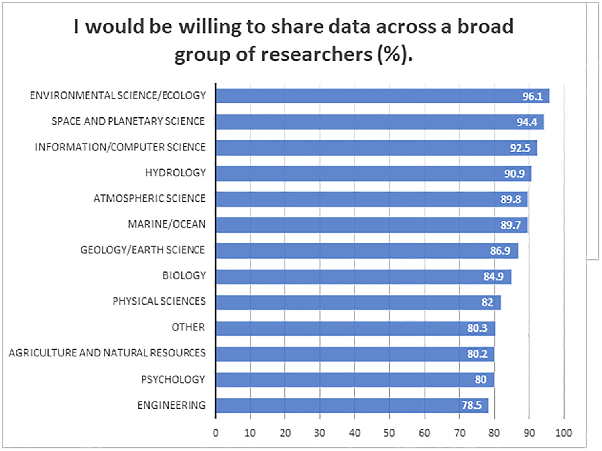

```{r setup, include=FALSE}
options(htmltools.dir.version = FALSE)
knitr::opts_chunk$set(collapse = TRUE,
                      fig.retina = 3)

```

```{r, load_refs, include=FALSE, cache=FALSE}
source("load_references.r")
```

name: title
class: Left, middle
background-image: url(images/rawpixel/nasa-moon.jpg)
background-size: cover


# .whiteinline[.fancy[`r rmarkdown::metadata$title`]]

### .whiteinline[`r rmarkdown::metadata$subtitle`]

.whiteinline[`r rmarkdown::metadata$description` &#183; `r rmarkdown::metadata$date`]

.right[.whiteinline[`r rmarkdown::metadata$author` &#183; Sergi Trilles]]

.right[.whiteinline[`r rmarkdown::metadata$institute`]]

???

Moon - north polar mosaic. Original from NASA.
Source: [Rawpixel](https://www.rawpixel.com/image/441553/north-polar-the-moon)

---
name: spacecraft
class: bottom, middle
background-image: url(images/rawpixel/nasa-cygnus-spacecraft.jpg)
background-size: cover


---
template: spacecraft

## You can't guarantee success,

### but you can guarantee failure: never try.

---
class: inverse, center, middle

# What does research mean for a PhD thesis today?

---
class: center


## Claim #1 
### All published research today has a computational component.

--

## Claim #2 
### There is a mismatch between the traditional scientific process and computation, leading to reproducibility concerns.

---
class: center
# What about you?

--

### Is your research dependent on computation? How much?

--

### Which computational tools do you use? Do you use them sporadically or frequently? Are general-purpose (Word, ...) or specific (SSPS,...) tools?

--

### In which phases do you use them?

--

.large[data collection, data storage, data analysis, data visualisation, writing, dissemination/presentation, communication, ...]


---
class: center
# Data sharing in academia

### Sequel of _Tenopir and colleagues_

.large[`r Cite(my_refs, "tenopir2011")`: _`r my_refs["tenopir2011"]$title`_]

.large[`r Cite(my_refs, "tenopir2015")`: _`r my_refs["tenopir2015"]$title`_]

.large[`r Cite(my_refs, "tenopir2020")`: _`r my_refs["tenopir2020"]$title`_]


---
class: center, middle


# Disciplines `r Cite(my_refs, "tenopir2020")`




---
class: center, middle

# Barriers `r Cite(my_refs, "tenopir2020")`


---
class: center
# What about you?

--

### Do your colleagues in your discipline share data?

--

### Do you share all or part of your data?

--

### Would you like to share (more) data?

--

### Which are the main barriers you face to data sharing?


---
class: center


## Claim #1 
### All published research today has a computational component.

--

.acid[Computational reproducibility]

--

## Claim #2 
### There is a mismatch between the traditional scientific process and computation, leading to reproducibility concerns.

--

.heat[Transparent research]


---
class: inverse, center, middle

# What does .acidinline[reproducibility] & .heatinline[transparency] mean for a PhD thesis today?


---
class: center

# `r my_refs["markowetz2015"]$title` `r Cite(my_refs, "markowetz2015")`

--

.pull-left[
### helps to avoid disaster

### makes it easier to write papers

### helps reviewers see it your way

### enables continuity of your work

### helps to build your reputation

]

--

.pull-right[


]


---
class: center

# `r my_refs["markowetz2015"]$title` `r Cite(my_refs, "markowetz2015")`


.pull-left[
### helps to avoid disaster

### makes it easier to write papers

### helps reviewers see it your way

### enables continuity of your work

### helps to build your reputation

]

.pull-right[

### .acidinline[You learn some new science]

### .heatinline[You keep your paper bug-free]

]

---
class: inverse, center, middle


# What's your choice?

---
class: center, bottom
background-image: url(images/rawpixel/clouds-nebraska.jpg)
background-size: cover


## .whiteinline[Business as usual scenario and irreproducible work remains the norm] `r Cite(my_refs["hong2015"])`


---
class: center, middle
background-image: url(images/rawpixel/beach.jpg)
background-size: cover


## Or you care about .acidinline[reproducibility] and .heatinline[transparency], and you are excited to acquire new reproducible research practices and habits! 

---

# References

```{r print_refs1, echo=FALSE, results="asis"}
PrintBibliography(my_refs)
```
